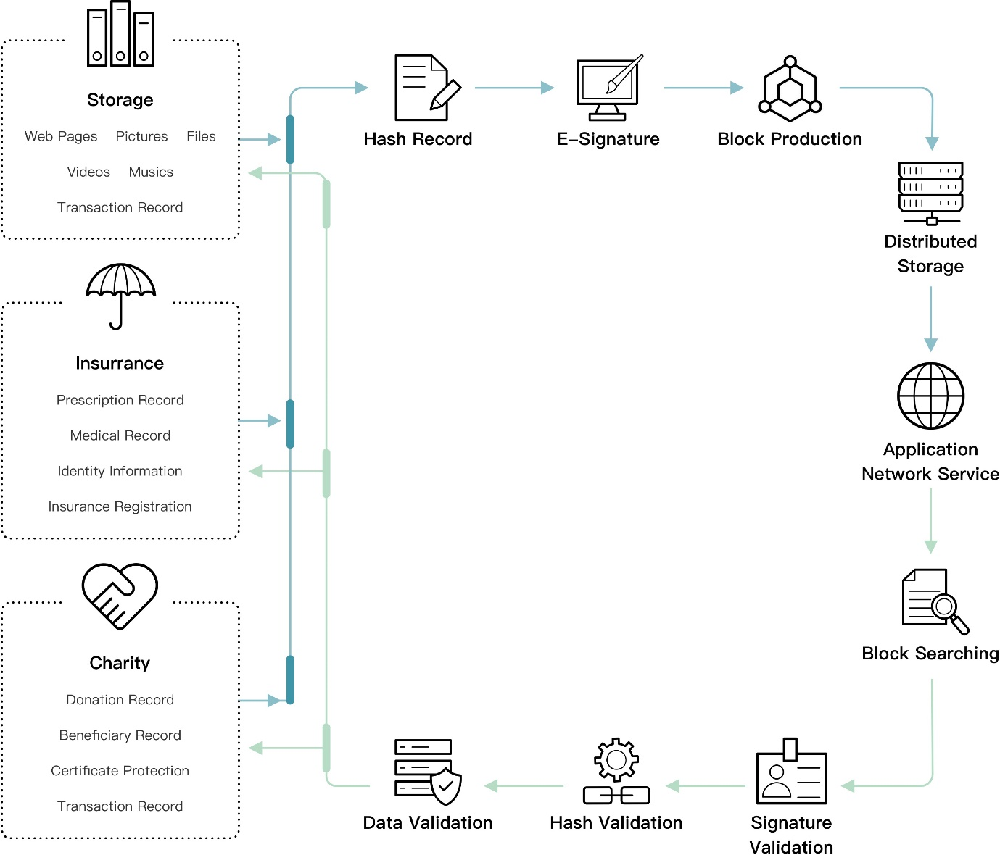

# Dimension-D
Sidechain DImension-D for insurrance, tracing and notary.

# Project Brief  

Dimension-D adopts blockchain technology to implement the notary system and store the data on-chain. It transforms the arbitrary length of input data into a fixed-length output through the hash algorithm and then performs a length verification algorithm from the original key. Dimension-D eliminates the possibility of data and documents being forged and altered from the source end, using a distributed storage system to process data on-chain providing ease of access.

Dimension-D is suitable for business that requires data verification, such as notary public, insurance, trust, charity, and others.

# Dimension-D Architecture
---

# License
[MIT License](LICENSE)

